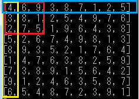

# **AI_Sudoku**
数独(ナンプレ)の問題を自動生成するアプリを作成中。  
処理はpython、GUIはC#で作成中。  

## *現状と今後*
---
### step1：解答の自動生成  
pythonで、解答を自動生成するところまで完成。
* *画面*  
  

### step2：GUIの作成(現状)  
GUIをC#で作成中  

### step3：問題の自動作成  
問題作成(解答から何カ所か空欄を作る)のプログラムは、pythonで作成。  
(必ず解答に辿りつける法則で自動生成)  

### step4：正誤判定など  
正誤判定、時間経過測定などを搭載。  

## *開発環境*
---
* python 3.7  
* c#(Visual Studio 2019)  
* Github  

## *製作者*
---
onikunai  
Github: https://github.com/onikunai  

